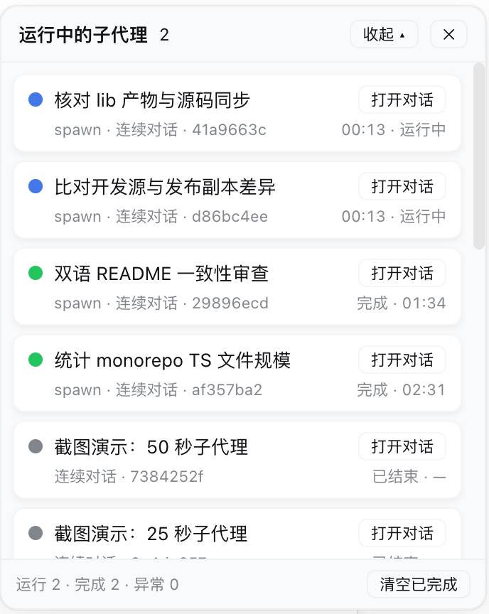

<h1 align="center">🤖 dsh-subagent-monitor</h1>

<p align="center">
  DeepSeek Harness (DSH) Web extension plugin · live subagent run monitor panel
  <br/>
  <a href="https://github.com/Mombrane/dsh-subagent-monitor/blob/master/LICENSE"></a>
  
  
</p>

[中文](README.md) | **English**

---

## ✨ What is it

Adds a **Subagents** entry at the bottom of the DSH Web sidebar and a card-style panel pinned to the **top-right** corner of the screen, showing the live run status of subagents spawned **directly** by the current session. Opening a subagent session moves the panel down to that session's direct children.

At the top of the panel sits an **overall dashboard**: three donut charts on the left show the main session's **current** context-window occupancy and the cache-hit rates of the main session and the aggregated subagents; a status bar chart on the right shows the current layer's running / done / failed counts (scaled to the largest count). Each card also carries a usage line (that run's input / output, cache hit, and context size).

The header's **Collapse** is **two-stage**: the first click hides only the subagent cards below (the overall dashboard above stays; the button becomes "Collapse all"), the second collapses all the way down to the title bar, and "Expand" restores the full panel in one step.

```
┌─ ⤢ Subagent dashboard ────────── [Collapse ▴] [✕] ┐
│  ◔ ctx ◔ main ◔ subagents     █ run 1 · █ done 1 · █ failed 0 │
│ ┌───────────────────────────────────────────────┐ │
│ │ 🔵 Count TS files in ui dir        [Open chat] │ │
│ │    one-shot · 1a2b3c4d    running · 00:42     │ │
│ │    ↑12.3k ↓4.5k · cache 78% · ctx 45.6k       │ │
│ └───────────────────────────────────────────────┘ │
│ ┌───────────────────────────────────────────────┐ │
│ │ 🟢 Demo subagent: count file types [Open chat] │ │
│ │    spawn · 2b3c4d5e       done · 03:12        │ │
│ └───────────────────────────────────────────────┘ │
│  running 1 · done 1 · failed 0     [Clear done]  │
│ ═══════════════════════════════════════════════ │ ← drag to resize
└───────────────────────────────────────────────────┘
```

> The `⤢` four-arrow grip left of the title moves the panel, the bottom `═` grip resizes it; both are remembered, double-click resets.
>
> **Collapse** is two-stage: the first click hides only the **subagent cards** below (the overall dashboard above stays; the button becomes "Collapse all"), the second collapses to just the title bar, and "Expand" restores the full panel in one step.



## 🎯 Features

| Feature | Description |
| --- | --- |
| 🟢 Live status | running (🔵 blue pixel-chase animation, same as the DSH sidebar state dot + stopwatch), done (green dot + halo), failed, interrupted, token limit, rejected |
| 🃏 Card list | one rounded card per subagent; **Open chat** on the right, status and elapsed time on the second line |
| 🔽 Layered view | shows only subagents spawned directly by the current session; open one to inspect its next layer |
| 🔙 One-click back | inside a subagent session, the panel shows a **← Parent session** button that jumps to the direct parent |
| 🖐 Movable | drag the four-arrow grip left of the title to move the panel; position is remembered (shared across sessions), double-click resets |
| 📏 Resizable | drag the bottom grip to resize the panel height; height is remembered per session, double-click resets |
| 🪗 Two-stage collapse | the header's **Collapse** first hides only the subagent cards (the overall dashboard above stays); **Collapse all** then reduces it to just the title bar; **Expand** restores the full panel in one step |
| 🔄 Refresh-proof | persistent composition row: the panel auto-recovers after page refresh / service restart |
| 📊 Overall dashboard | summary strip above the cards: three donut charts (main-session **current** context-window occupancy, main-session / subagent cache-hit rates) + a status bar chart (running / done / failed counts, scaled to the largest count) |
| ⚡ Usage line | each card shows that run's input / output tokens, cache-hit rate, accumulated context, and context-window utilization (when the provider reports it) |
| 🎯 Current occupancy | the main session's "context" ring shows the **current** window occupancy (`projectedTokens`: newest prompt sample + heuristic surface movement) — it rises as content lands and **drops immediately after compaction**, rather than the session-cumulative figure that only grows |
| 🌐 Chinese / English | panel copy follows the host UI language (Settings → General → Language); it falls back to Chinese when the host names no language, or one it ships no copy for |
| 📱 Mobile-friendly | hidden by default at ≤768px viewport; the sidebar entry still opens it manually |

## 📦 Installation

### Option A · npm (recommended, one line)

```bash
dsh plugin --profile <your-profile> add @leetoners/dsh-ui-subagent-monitor
```

> ✅ Published as `v0.3.0` (built and signed by GitHub Actions; SLSA provenance verifiable).

### Option B · Install from GitHub

```bash
dsh plugin --profile <your-profile> add github:Mombrane/dsh-subagent-monitor
# On first install, if prompted to allow build scripts, confirm in the profile's pnpm-workspace.yaml
```

Restart `dsh web` to take effect. This repository is both a **DSH client plugin** (`dsh.client`) and a **composition bundle** (`dsh.bundle` + `cordis.patch.yml`), shipped with a prebuilt `lib/`.

### Option C · Inline into the DSH source tree (for secondary development)

```bash
# 1. Copy this repo's src/ to <dsh>/packages/client/ui-subagent-monitor/
# 2. Add the dependency to <dsh>/packages/bundle/web-app/package.json
"@leetoners/dsh-ui-subagent-monitor": "workspace:*"
```

```yaml
# 3. <dsh>/packages/bundle/web-app/cordis.patch.yml (after the ui-subagent row)
- id: ui-subagent-monitor
  name: '@leetoners/dsh-ui-subagent-monitor'
```

```bash
# 4. Build + restart
pnpm install && pnpm --filter @leetoners/dsh-ui-subagent-monitor bundle
# restart dsh web
```

> Also add this package path to `references` in <dsh>/tsconfig.client.json, and point this
> package's `tsdown.config.ts` at the monorepo preset (`import { clientBundle } from '../tsdown.client.ts'`).

## 🏷️ Status legend

| Status | Meaning |
| --- | --- |
| 🔵 Running | in progress, blue pixel-chase animation (same as the DSH sidebar tab ongoing state) + live stopwatch |
| 🟢 Done | the panel witnessed a successful finish; shows elapsed time (green dot + halo) |
| ⚪ Ended | backfilled history row: created before a service restart, outcome not observed (success/failure unknown) |
| 🔴 Failed | ended in error (red dot + halo) |
| 🟠 Interrupted / token limit / rejected | aborted / hit the token cap / request rejected (amber dot + halo) |

## ❓ FAQ

**Does the panel disappear on page refresh?** No. It is a persistent composition row; the panel auto-recovers on every page load.

**What is the difference between “Done” and “Ended”?** 🟢 is an outcome the panel observed live; ⚪ is history from before a service restart, outcome not observed.

**How much history does the panel keep?** At most 200 rows per direct parent session; the oldest ended rows are evicted beyond that.

**Are the panel position and height remembered?** Yes, with two different policies: the **position is shared across sessions** (one spot for all of them), while the **height is remembered per session** (localStorage key carries the session id, so switching sessions never leaks the size); they survive page reload / browser restart. Double-click a grip to reset.

**Where do the usage / cache numbers come from?** They are folded from each subagent's own session log — provider-reported TokenUsage on `assistant/message` events. Live children are read from memory; cold ones from the persisted log (cached). Data appears only when the adapter reports usage; otherwise the panel shows “—”.

**Is it safe?** The polling route `/api/subagent-monitor/snapshot` binds to the loopback address with no auth; recommended for local / intranet use only.

## 🌐 Ecosystem

| Channel | Status |
| --- | --- |
| GitHub topics | `dsh-plugin`, `deepseek-harness` (auto-synced by Oh-My-DSH every 4 hours) |
| Oh-My-DSH catalog | PR [#8](https://github.com/like-study1/Oh-My-DSH/pull/8) pending maintainer merge |
| awesome-dsh-plugin | ✅ Listed (commit `c7ad36e9`, PR [#675](https://github.com/awesome-dsh-plugin/awesome-dsh-plugin/pull/675) merged) |

## 📋 Changelog

See [CHANGELOG.md](./CHANGELOG.md) for the full history. Current version **0.3.0** (aligned with `package.json`).

## 📖 Architecture

Design decisions (why persistent, why a custom polling route, event attribution model) and data-flow details: [ARCHITECTURE.md](./ARCHITECTURE.md).

## 📄 License

[MIT](./LICENSE) © Mombrane
